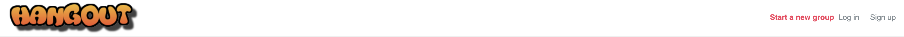
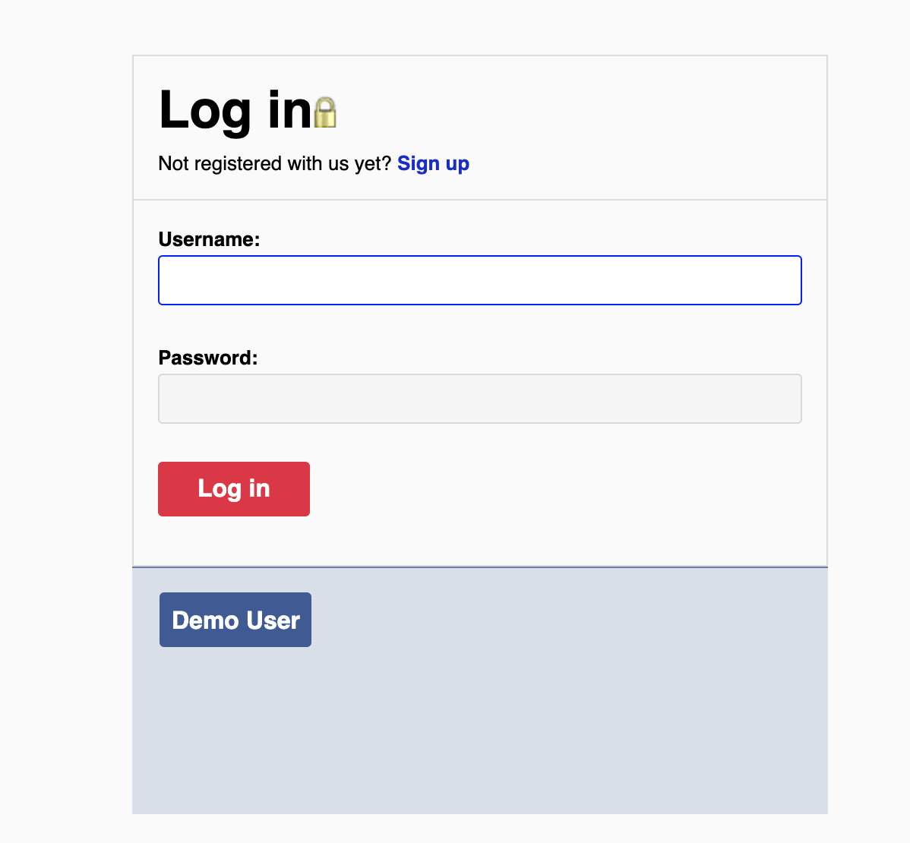

<h1>Hangout - Cloned Meetup App</h1>

<h1>August 2019 App Academy Cohort</h1>

<h1>Architecture and Technologies</h1>
Hangout implements the below technologies:

<h2>Frontend</h2>
<ul>
<li>JavaScript</li>
<li>Ruby 2.5.1</li>
<li>React 16.10.2</li>
<li>Redux 4.0.4</li>
<li>webpack 4.41.0</li>
</ul>

<h2>Backend</h2>
<ul>
<li>Ruby on Rails 5.2.3</li>
<li>PostgreSQL</li>
</ul>

Hangout is a single-page, full-stack web application modeled after MeetUp.  Hangout, mimics the same frontend UI features and matches the theme of the meetup website using matching hover effects, color schemes, font and placement of the html elements using React components.  The clone was implemented using Ruby on Rails, PostgresSQL, React and Redux.  

<h1>Authorization</h1>

Hangout uses backend authentication through the use of a password disgest.  The password digest is hashed using BCrypt and stored in a DB.  There is also a persisted user state which allows a user to remain logged in through refresh with cookies. The approrate error messages will also appear when a user logs in incorrectly or enters an invalid sign up form.  The application allows the user to navigate to the sign in page and signup to the application assumming the user creates a password of at least 6 characters.  The login page allows the user to login if they have successfully signed up previously or use the DemoUser provided.

<h1>Groups</h1>

The application currently sorts seeded database data based on whether the user is a leader of the group.  If they are a leader once logged in they are directed to a page that sorts groups they lead on top and suggests other groups to join, this is the group_index page.  Once on the group_index the user may view more group details by linking to the group_show page that displays all group related information.

<h1>Navbar</h2>

This Navbar was a point of focus because the height, the colors and the number of right-side links would change on each page.  This required a switch statement that would modify the right-side of the navigation bar based on the page implementing it.  A property passed into the Navbar through the MapStateToProps called sourceType was the condition for the switch.

<h3>Autofocus in React</h3>

To get the page to autofocus in the login's username text input it required the use of a react ref.   React Refs are useful features that reference a DOM element or a class component from within a parent component, giving access to read or modify an element.  Below is the code implemented in the componentDidMount lifecycle method and the ref callback used in the html input.  An image of the login form is included below.

componentDidMount() {
    this.username.focus();
}

<input type="text"
    name="username"
    ref={(input) => { this.username = input; }} />

